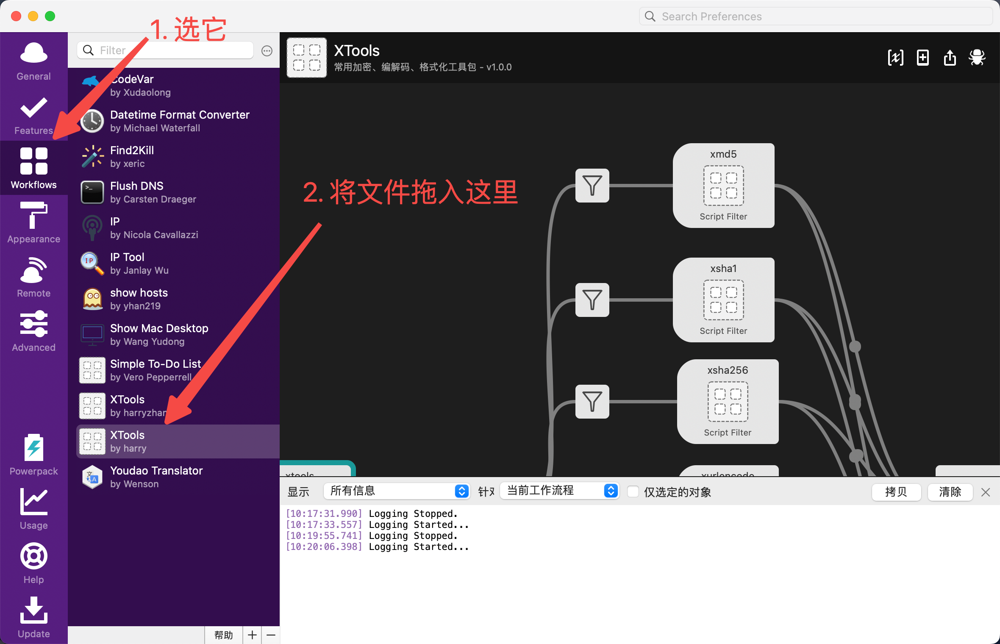
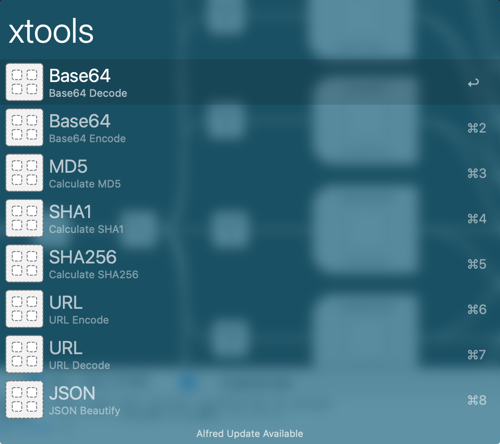
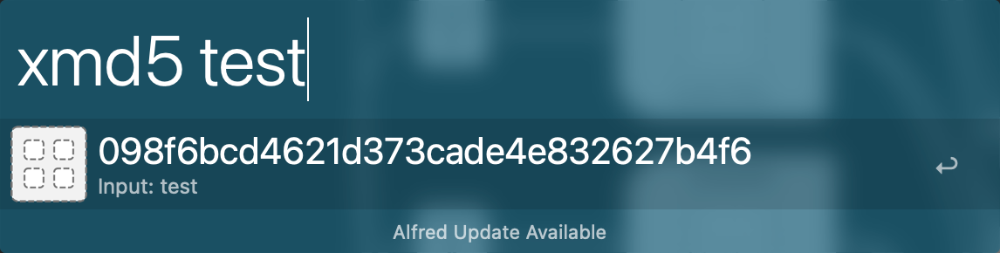

## XTools 简介

一个基于 Alfred Workflow 开发的工具集，能够快速对文本进行常见算法加密（MD5、SHA1、SHA256）、编解码（URL、Base64）、格式化（JSON）

## 安装
### 环境要求

- MacOS
- Alfred 已安装
- Python2 已安装

### 安装步骤

1. 下载 [XTools.Workflow](https://github.com/harryzhz/alfred-xtools/releases/download/v1.0.0/XTools-v1.0.0.alfredworkflow) 文件到本地
2. 打开 Alfred Workflows 窗口，直接将文件拖入即可


### 本地配置

本工具用 Python2 开发，所以要求本地安装 Python2，工具配置的 python 路径为`/usr/local/bin/python2`

如果你的 python 路径不一致需要建立软链接
```bash
ln -s $YourPythonPath /usr/local/bin/python2
```

## 使用

按照上述安装步骤安装完成后，你可以用如下方式开启使用之旅

### 1. 使用「xtools」关键字选择命令，如下图



### 2. 直接使用命令对应的关键字，目前支持以下关键字

- xmd5
- xsha1
- xsha256
- xbase64en
- xbase64de
- xurlencode
- xurldecode
- xjsonbf
   
比如计算 md5，可以使用关键字「xmd5」，如下图所示

